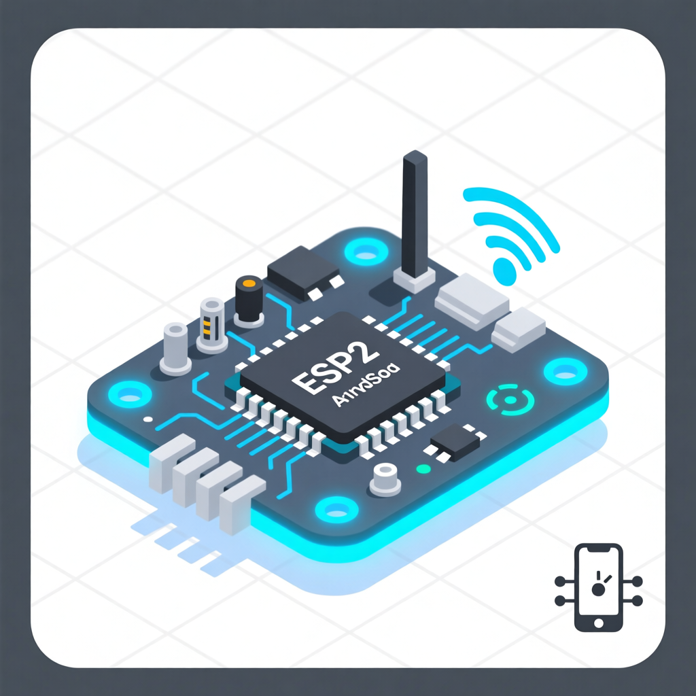
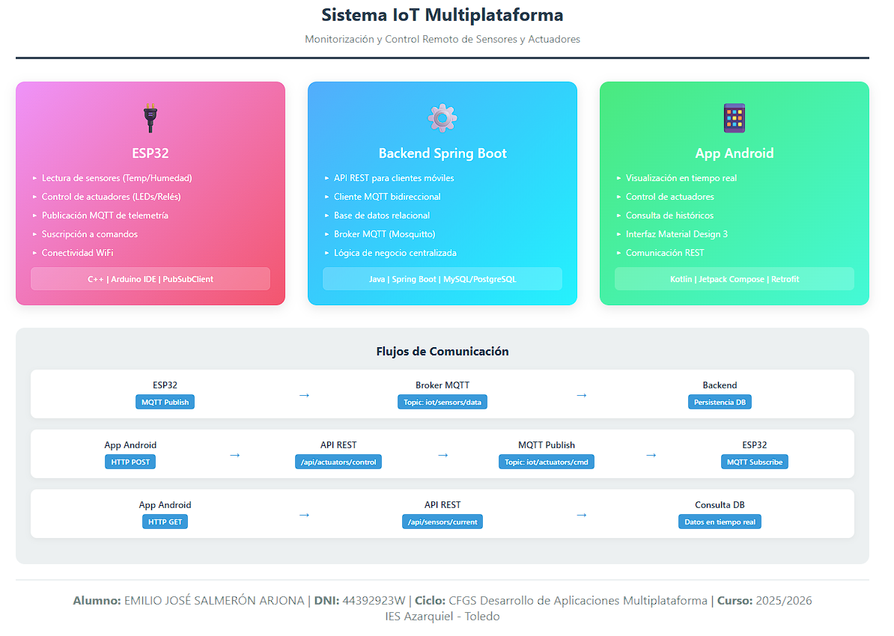
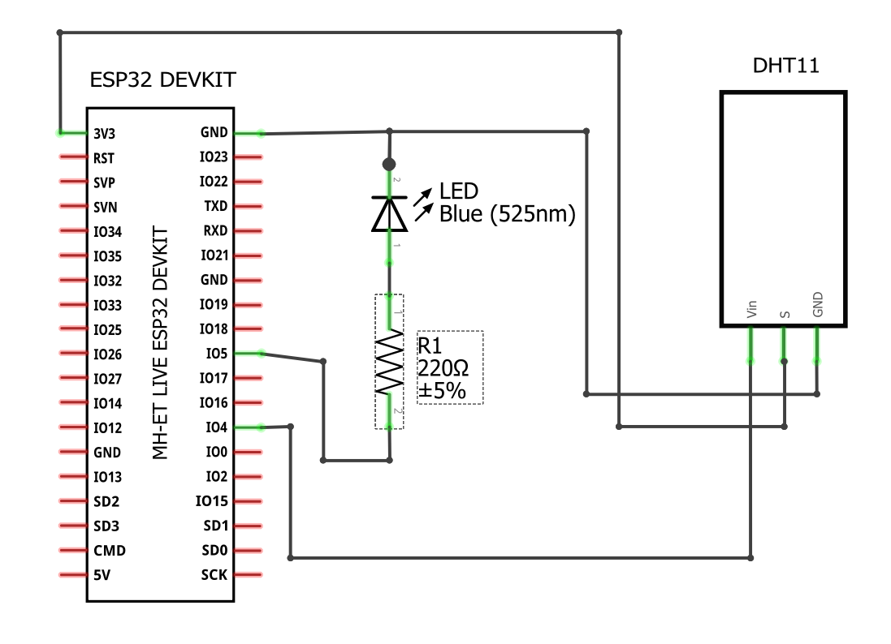
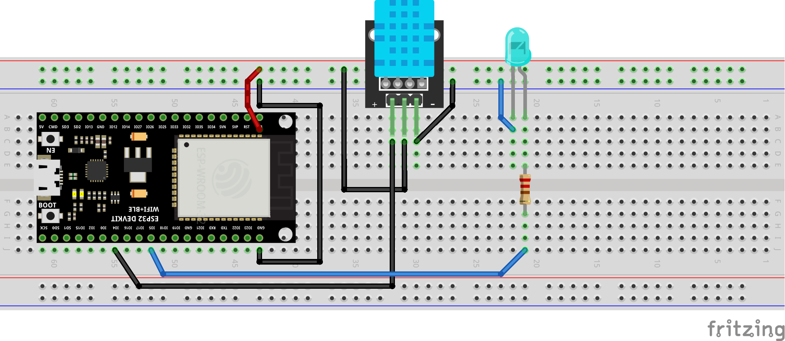
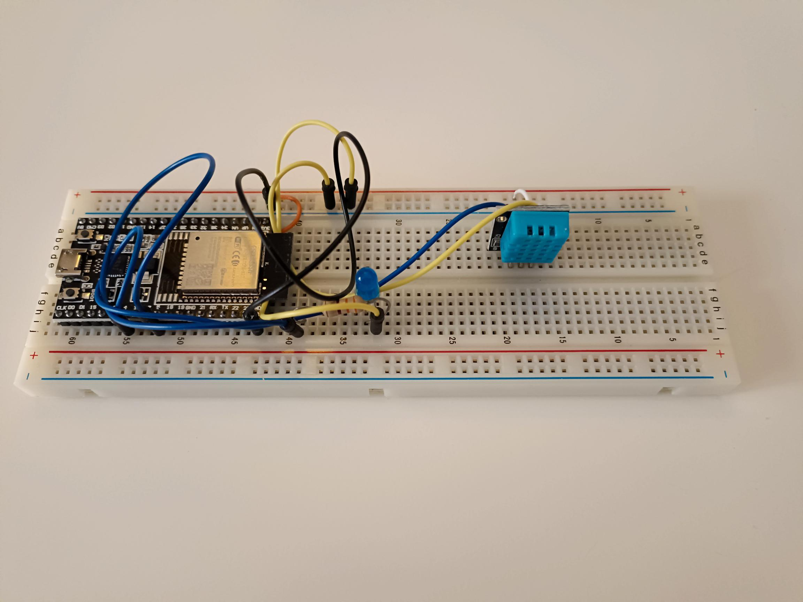

# Diagramas, esquemas e imágenes DAMIOT

## Logotipo:

Usado en título de memoria del proyecto y en iconografía de la App Android.

#### Mapa conceptual Sistema IOT DAMIOT

## ESP32 DevKitC. Imagen y Pin layout.

## Esquema de circuito electrónico y simulación en protoboard.

## Fotografía del montaje real

